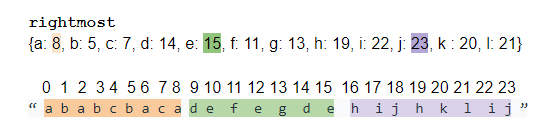

# LeetCode - Problem 763 - Partition Labels

#### Description

A string S of lowercase English letters is given. We want to partition this string into as many parts as possible so that each letter appears in at most one part, and return a list of integers representing the size of these parts.

#### Examples

```
Example 1:

Input: S = "ababcbacadefegdehijhklij"
Output: [9,7,8]
Explanation:
The partition is "ababcbaca", "defegde", "hijhklij".
This is a partition so that each letter appears in at most one part.
A partition like "ababcbacadefegde", "hijhklij" is incorrect, because it splits S into less parts.
``` 

**Note:**

* `S` will have length in range `[1, 500]`.
* `S` will consist of lowercase English letters ('a' to 'z') only.
 
#### Solution

Figure out the rightmost index first and use it to denote the start of the next section.

Reset the left pointer at the start of each new section.

Store the difference of right and left pointers + 1 as in the result for each section.



```python
from typing import List

class Solution:
    def partitionLabels(self, S: str) -> List[int]:
        rightmost = {c:i for i, c in enumerate(S)}
        left, right = 0, 0
    
        result = []
        for i, letter in enumerate(S):
    
            right = max(right,rightmost[letter])
        
            if i == right:
                result += [right-left + 1]
                left = i+1
    
        return result
```