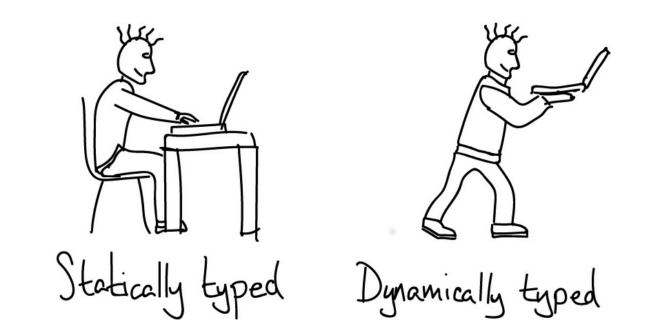
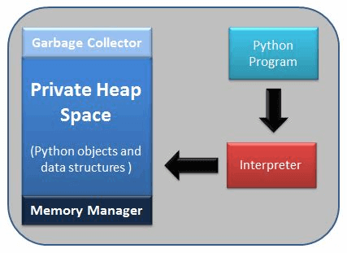

# Python Quick Revision

This page will guide you on how to crack any python programming interview, including:

1. [Real World Python Interview Questions](#real-world-python-interview-questions)
   Real-World Python interview questions asked in companies like Microsoft, 
   Google, Amazon and how to answer them 
   (saving your interview preparation time).

1. [Python Practice Problems](#python-practice-problems)
   Python practice problems which you can solve right away.
   
## Real World Python Interview Questions
**1. What is Python?**

Python is a high-level, interpreted, general-purpose programming language. Being a general-purpose language, it can be used to build almost any type of application with the right tools/libraries. Additionally, python supports objects, modules, threads, exception-handling and automatic memory management which help in modelling real-world problems and building applications to solve these problems.

**2. What are the benefits of using Python?**

Python is a general-purpose programming language that has simple, easy-to-learn syntax which emphasizes readability and therefore reduces the cost of program maintenance. Moreover, the language is capable of scripting, completely open-source and supports third-party packages encouraging modularity and code-reuse.
Its high-level data structures, combined with dynamic typing and dynamic binding, attract a huge community of developers for Rapid Application Development and deployment.

**3. What is a dynamically typed language?**

Before we understand what a dynamically typed language, we should learn about what typing is. **Typing** refers to type-checking in programming languages. In a **___strongly-typed___**  language, such as Python, **"1" + 2** will result in a type error, since these languages don't allow for **"type-coercion"** (implicit conversion of data types). On the other hand, a **___weakly-typed___** language, such as Javascript, will simply output **"12"** as result.

Type-checking can be done at two stages -

1. **Static -** Data Types are checked before execution.
1. **Dynamic -** Data Types are checked during execution.

Python being an interpreted language, executes each statement line by line and thus type-checking is done on the fly, during execution. Hence, Python is a Dynamically Typed language.



**4. What is an interpreted language?**

An **Interpreted** language executes its statements line by line. Languages such as Python, Javascript, R, PHP and Ruby are prime examples of Interpreted languages. Programs written in an interpreted language runs directly from the source code, with no intermediary compilation step.

**5. What is PEP 8 and why is it important?**

PEP stands for **Python Enhancement Proposal**. A PEP is an official design document providing information to the Python Community, or describing a new feature for Python or its processes. **PEP 8** is especially important since it documents the style guidelines for Python Code. Apparently contributing in the Python open-source community requires you to follow these style guidelines sincerely and strictly.

**6. How is memory managed in Python?**

Memory management in Python is handled by the **Python Memory Manager**. The memory allocated by the manager is in form of a private heap space dedicated for Python. All Python objects are stored in this heap and being private, it is inaccessible to the programmer. Though, python does provide some core API functions to work upon the private heap space.
Additionally, Python has an in-built garbage collection to recycle the unused memory for the private heap space.



**7. What are Python namespaces? Why are they used?**

A namespace in Python ensures that object names in a program are unique and can be used without any conflict. Python implements these namespaces as dictionaries with 'name as key' mapped to a corresponding 'object as value'. This allows for multiple namespaces to use the same name and map it to a separate object. A few examples of namespaces are as follows:

* **Local Namespace** includes local names inside a function. the namespace is temporarily created for a function call and gets cleared when the function returns.
* **Global Namespace** includes names from various imported packages/ modules that is being used in the current project. This namespace is created when the package is imported in the script and lasts until the execution of the script.
* **Built-in Namespace** includes built-in functions of core Python and built-in names for various types of exceptions.

**Lifecycle of a namespace** depends upon the scope of objects they are mapped to. If the scope of an object ends, the lifecycle of that namespace comes to an end. Hence, it isn't possible to access inner namespace objects from an outer namespace.


**8. What is Scope in Python?**

Every object in Python functions within a scope. A **scope** is a block of code where an object in Python remains relevant. Namespaces uniquely identify all the objects inside a program. However, these namespaces also have a scope defined for them where you could use their objects without any prefix. A few examples of scope created during code execution in Python are as follows:

1. A **local scope** refers to the local objects available in the current function.
1. A **global scope** refers to the objects available throughout the code execution since their inception.
1. A **module-level scope** refers to the global objects of the current module accessible in the program.
1. An **outermost scope** refers to all the built-in names callable in the program. The objects in this scope are searched last to find the name referenced.

___Note: Local scope objects can be synced with global scope objects using keywords such as **global**.___

**9. What is Scope Resolution in Python?**

Sometimes objects within the same scope have the same name but function differently. In such cases, scope resolution comes into play in Python automatically. A few examples of such behaviour are:

* Python modules namely 'math' and 'cmath' have a lot of functions that are common to both of them - `log10()`, `acos()`, `exp()` etc. To resolve this ambiguity, it is necessary to prefix them with their respective module, like `math.exp()` and `cmath.exp()`.
* Consider the code below, an object `temp` has been initialized to 10 globally and then to 20 on function call. However, the function call didn't change the value of the `temp` globally. Here, we can observe that Python draws a clear line between global and local variables treating both their namespaces as separate identities.

```python
temp = 10 	 # global-scope variable

def func():
    temp = 20   # local-scope variable
    print(temp)

print(temp) 	 # output => 10
func() 		 # output => 20
print(temp) 	 # output => 10
```

This behaviour can be overridden using the `global` keyword inside the function, as shown in the following example:

```python
temp = 10 	 # global-scope variable

def func():
    global temp
    temp = 20   # local-scope variable
    print(temp)

print(temp) 	 # output => 10
func() 		 # output => 20
print(temp) 	 # output => 20
```

**10. What are decorators in Python?**

**Decorators** in Python are essentially functions that add functionality to an existing function in Python without changing the structure of the function itself. They are represented by the `@decorator_name` in Python and are called in bottom-up fashion. For example:

```python
# decorator function to convert to lowercase
def lowercase_decorator(function):
    def wrapper():
        func = function()
        string_lowercase = func.lower()
        return string_lowercase
    return wrapper

# decorator function to split words
def splitter_decorator(function):
    def wrapper():
        func = function()
        string_split = func.split()
        return string_split
    return wrapper

@splitter_decorator	# this is executed next
@lowercase_decorator	# this is executed first
def hello():
    return 'Hello World'

hello() 	 # output => [ 'hello' , 'world' ]
```

The beauty of the decorators lies in the fact that besides adding functionality to the output of the method, they can even **accept arguments** for functions and can further modify those arguments before passing it to the function itself. The **inner nested function**, i.e. 'wrapper' function, plays a significant role here. It is implemented to enforce **encapsulation** and thus, keep itself hidden from the global scope.

```python
# decorator function to capitalize names
def names_decorator(function):
    def wrapper(arg1, arg2):
        arg1 = arg1.capitalize()
        arg2 = arg2.capitalize()
        string_hello = function(arg1, arg2)
        return string_hello
    return wrapper

@names_decorator
def say_hello(name1, name2):
    return 'Hello ' + name1 + '! Hello ' + name2 + '!'

say_hello('sara', 'ansh') 	 # output => 'Hello Sara! Hello Ansh!'
```

**11. What are lists and tuples? What is the key difference between the two?**

**Lists** and **Tuples** are both **sequence data types** that can store a collection of objects in Python. 
The objects stored in both sequences can have different data types. 
Lists are represented with **square brackets** `['sara', 6, 0.19]`, 
while tuples are represented with **parentheses** `('ansh', 5, 0.97)`.
But, what is the real difference between the two? 
The key difference between the two is that while **lists are mutable**, 
**tuples** on the other hand are **immutable objects**. 
This means that lists can be modified, appended or sliced on-the-go but tuples remain constant 
and cannot be modified in any manner. You can run the following example on **Python IDLE** (<ins>**I**</ins>ntegrated <ins>**D**</ins>evelopment and <ins>**L**</ins>earning <ins>**E**</ins>nvironment) to confirm the difference:

```python
my_tuple = ('sara', 6, 5, 0.97)
my_list = ['sara', 6, 5, 0.97]

print(my_tuple[0])     # output => 'sara'
print(my_list[0])     # output => 'sara'

my_tuple[0] = 'ansh'    # modifying tuple => throws an error
my_list[0] = 'ansh'    # modifying list => list modified

print(my_tuple[0])     # output => 'sara'
print(my_list[0])     # output => 'ansh'
```

NOTE: **Python IDLE** (<ins>**I**</ins>ntegrated <ins>**D**</ins>evelopment and <ins>**L**</ins>earning <ins>**E**</ins>nvironment) is an integrated development environment (IDE) for Python.
It is the best place to experiment with Python code and provides an interactive interpreter, otherwise known as a shell. 
The shell is a basic [Read-Eval-Print Loop (REPL)](https://en.wikipedia.org/wiki/Read%E2%80%93eval%E2%80%93print_loop). 
It reads a Python statement, evaluates the result of that statement, and then prints the result on the screen. Then, it loops back to read the next statement.

**12. What are Dict and List comprehensions?**

Python comprehensions, like decorators, are **syntactic sugar** constructs that help **build altered and filtered** lists, dictionaries or sets from a given list, dictionary or set. Using comprehensions, saves a lot of time and code that might be considerably more verbose (containing more lines of code). Let's check out some examples, where comprehensions can be truly beneficial:

* **Performing mathematical operations on the entire list**

```python
my_list = [2, 3, 5, 7, 11]

squared_list = [x**2 for x in my_list]    # list comprehension
# output => [4 , 9 , 25 , 49 , 121]

squared_dict = {x:x**2 for x in my_list}    # dict comprehension
# output => {11: 121, 2: 4 , 3: 9 , 5: 25 , 7: 49}
```

* **Performing conditional filtering operations on the entire list**

```python
my_list = [2, 3, 5, 7, 11]

squared_list = [x**2 for x in my_list if x%2 != 0]    # list comprehension
# output => [9 , 25 , 49 , 121]

squared_dict = {x:x**2 for x in my_list if x%2 != 0}    # dict comprehension
# output => {11: 121, 3: 9 , 5: 25 , 7: 49}
```

* **Combining multiple lists into one**

Comprehensions allow for multiple iterators and hence, can be used to combine multiple lists into one.

```python
a = [1, 2, 3]
b = [7, 8, 9]

[(x + y) for (x,y) in zip(a,b)]  # parallel iterators
# output => [8, 10, 12]

[(x,y) for x in a for y in b]    # nested iterators
# output => [(1, 7), (1, 8), (1, 9), (2, 7), (2, 8), (2, 9), (3, 7), (3, 8), (3, 9)]
```

* **Flattening a multi-dimensional list**

A similar approach of nested iterators (as above) can be applied to flatten a multi-dimensional list or work upon its inner elements.

```python
my_list = [[10,20,30],[40,50,60],[70,80,90]]

flattened = [x for temp in my_list for x in temp]
# output => [10, 20, 30, 40, 50, 60, 70, 80, 90]
```

___**Note:** List comprehensions have the same effect as the `map` method in other languages. They follow the **mathematical set builder notation** rather than map and filter functions in Python.___

**13. What are the common built-in data types in Python?**

There are several built-in data types in Python. Although, Python doesn't require data types to be defined explicitly during variable declarations but type errors are likely to occur if the knowledge of data types and their compatibility with each other are neglected. Python provides `type()` and `isinstance()` functions to check the type of these variables. These data types can be grouped into the following catetgories-

* **None Type**
`None` keyword represents the null values in Python. Boolean equality operation can be performed using these NoneType objects.

| Class Name | Description |
| ---------- | ----------- |
| NoneType	 | Represents the **NULL** values in Python |

* **Numeric Types**
There are three distinct numeric types - **___integers, floating-point numbers___**, and **___complex numbers___**. Additionally, **___booleans___** are a sub-type of integers.

| Class Name | Description |
| ---------- | ----------- |
| `int`	     | Stores integer literals including hex, octal and binary numbers as integers |
| `float`	 | Stores literals containing decimal values and/or exponent sign as floating-point numbers |
| `complex`	 | Stores complex number in the form (A + Bj) and has attributes: `real` and `imag` |
| `bool`     | Stores boolean value (`True` or `False`) |

___**Note:** The standard library also includes **fractions** to store rational numbers and **decimal** to store floating-point numbers with user-defined precision.___

* **Sequence Types**
According to Python Docs, there are three basic Sequence Types - ___**lists**___, ___**tuples**___, and ___**range objects**___. Sequence types have the `in` and `not in` operators defined for their traversing their elements. These operators share the same priority as the comparison operations.

| Class Name | Description |
| ---------- | ----------- |
| `list`	 | Mutable sequence used to store collection of items. |
| `tuple`    | Immutable sequence used to store collection of items. |
| `range`    | Represents an immutable sequence of numbers generated during execution. |
| `str`	     | Immutable sequence of Unicode code points to store textual data. |

___**Note:** The standard library also includes additional types for processing:___

___1. **Binary data** such as `bytearray` `bytes` `memoryview` , and___

___2. **Text strings** such as `str`.___

* **Mapping Types**
A mapping object can map ___hashable values___ to random objects in Python. Mappings objects are mutable and there is currently only one standard mapping type, the **___dictionary___**.

| Class Name | Description |
| ---------- | ----------- |
| `dict`     | Stores comma-separated list of key: value pairs |

* **Set Types**
Currently, Python has two built-in set types - **set** and **frozenset**. **set** type is mutable and supports methods like `add()` and `remove()`. **frozenset** type is immutable and can't be modified after creation.

| Class Name | Description |
| ---------- | ----------- |
| set	     | Mutable unordered collection of distinct hashable objects |
| frozenset	 | Immutable collection of distinct hashable objects |

___**Note:** `set` is mutable and thus cannot be used as key for a dictionary. On the other hand, `frozenset` is immutable and thus, hashable, and can be used as a dictionary key or as an element of another set.___

* **Modules**
Module is an additional built-in type supported by the Python Interpreter. It supports one special operation, i.e., **attribute access**: `mymod.myobj`, where **mymod** is a module and **myobj** references a name defined in m's symbol table. The module's symbol table resides in a very special attribute of the module **__dict__**, but direct assignment to this module is neither possible nor recommended.

* **Callable Types**
Callable types are the types to which function call can be applied. They can be **user-defined functions**, **instance methods**, **generator functions**, and some other **built-in functions**, **methods** and **classes**.
Refer the documentation at [docs.python.org](https://docs.python.org/3/reference/datamodel.html) for a detailed view into the **callable types**.

**14. What is lambda in Python? Why is it used?**

Lambda is an anonymous function in Python, that can accept any number of arguments, but can only have a single expression. It is generally used in situations requiring an anonymous function for a short time period. Lambda functions can be used in either of the two ways:

* Assigning lambda functions to a variable
```python
mul = lambda a, b : a * b
print(mul(2, 5))    # output => 10
```
* Wrapping lambda functions inside another function
```python
def myWrapper(n):
    return lambda a : a * n

mulFive = myWrapper(5)
print(mulFive(2))    # output => 10
```

**15. What is pass in Python?**
The `pass` keyword represents a null operation in Python. It is generally used for the purpose of filling up empty blocks of code which may execute during runtime but has yet to be written. Without the **pass** statement in the following code, we may run into some errors during code execution.

```python
def myEmptyFunc():
    # do nothing
    pass

myEmptyFunc()    # nothing happens

## Without the pass keyword
# File "<stdin>", line 3
# IndentationError: expected an indented block
```

**16. How do you copy an object in Python?**

In Python, the assignment statement (`=` operator) does not copy objects. Instead, it creates a binding between the existing object and the target variable name. To create copies of an object in Python, we need to use the copy module. Moreover, there are two ways of creating copies for the given object using the `copy` module -

**Shallow Copy** is a bit-wise copy of an object. The copied object created has an exact copy of the values in the original object. If either of the values are references to other objects, just the reference addresses for the same are copied.
**Deep Copy** copies all values recursively from source to target object, i.e. it even duplicates the objects referenced by the source object.

```python
from copy import copy, deepcopy

list_1 = [1, 2, [3, 5], 4]

## shallow copy

list_2 = copy(list_1) 
list_2[3] = 7
list_2[2].append(6)

list_2    # output => [1, 2, [3, 5, 6], 7]
list_1    # output => [1, 2, [3, 5, 6], 4]

## deep copy

list_3 = deepcopy(list_1)
list_3[3] = 8
list_3[2].append(7)

list_3    # output => [1, 2, [3, 5, 6, 7], 8]
list_1    # output => [1, 2, [3, 5, 6], 4]
```

**17. What is the difference between xrange and range in Python?**

**xrange()** and **range()** are quite similar in terms of functionality. They both generate a sequence of integers, with the only difference that `range()` returns a **Python list**, whereas, `xrange()` returns an **xrange object**.

**So how does that make a difference?** It sure does, because unlike range(), xrange() doesn't generate a static list, it creates the value on the go. This technique is commonly used with an object type **generators** and has been termed as **"yielding"**.

**Yielding** is crucial in applications where memory is a constrained. Creating a static list as in range() can lead to a **Memory Error** in such conditions, while, xrange() can handle it optimally by using just enough memory for the generator (significantly less in comparison).

```python
for i in xrange(10):    # numbers from o to 9
    print i       # output => 0 1 2 3 4 5 6 7 8 9

for i in xrange(1,10):    # numbers from 1 to 9
    print i       # output => 1 2 3 4 5 6 7 8 9

for i in xrange(1, 10, 2):    # skip by two for next
    print i       # output => 1 3 5 7 9
```

___**Note:** **xrange** has been **deprecated** as of **Python 3.x**. Now **range** does exactly the same what **xrange** used to do in **Python 2.x**, since it was way better to use xrange() than the original range() function in Python 2.x.___

**18. What are modules and packages in Python?**

Python packages and Python modules are two mechanisms that allow for **modular programming** in Python. Modularizing ahs several advantages -

1. **Simplicity:** Working on a single module helps you focus on a relatively small portion of the problem at hand. This makes development easier and less error-prone.
2. **Maintainability:** Modules are designed to enforce logical boundaries between different problem domains. If they are written in a manner that reduces interdependency, it is less likely that modifications in a module might impact other parts of the program.
3. **Reusability:** Functions defined in a module can be easily reused by other parts of the application.
4. **Scoping:** Modules typically define a separate namespace, which helps avoid confusion between identifiers from other parts of the program.

**Modules**, in general, are simply Python files with a .py extension and can have a set of functions, classes or variables defined and implemented. They can be imported and initialized once using the `import` statement. If partial functionality is needed, import the requisite classes or functions using `from foo import bar`.

**Packages** allow for hierarchical structuring of the module namespace using **dot notation**. As, **modules** help avoid clashes between global variable names, in a similar manner, **packages** help avoid clashes between module names.
Creating a package is easy since it makes use of the system's inherent file structure. So just stuff the modules into a folder and there you have it, the folder name as the package name. Importing a module or its contents from this package requires the package name as prefix to the module name joined by a dot.

___**Note:** You can technically import the package as well, but alas, it doesn't import the modules within the package to the local namespace, thus, it is practically useless.___

**19. What are global, protected and private attributes in Python?**

**Global** variables are public variables that are defined in the global scope. To use the variable in the global scope inside a function, we use the `global` keyword.

**Protected** attributes are attributes defined with an underscore prefixed to their identifier eg. **_sara**. They can still be accessed and modified from outside the class they are defined in, but a responsible developer, should refrain from doing so.

**Private** attributes are attributes with double underscore prefixed to their identifier eg. **__ansh**. They cannot be accessed or modified from the outside directly and will result in an `AttributeError` if such an attempt is made.

**20. What is `self` in Python?**

`self` is a keyword in Python used to define an instance or an object of a class. In Python, it is explicity used as the first paramter, unlike in Java where it is optional. It helps in disinguishing between the methods and attributes of a class from its local variables.

**21. What is `__init__`?**

`__init__` is a constructor method in Python and is automatically called to allocate memory when a new object/instance is created. All classes have a **__init__** method associated with them. It helps in distinguishing methods and attributes of a class from local variables.

```python
# class definition
class Student:
    def __init__(self, fname, lname, age, section):
        self.firstname = fname
        self.lastname = lname
        self.age = age
        self.section = section

# creating a new object
stu1 = Student("Sara", "Ansh", 22, "A2")
```

**22. What is `break`, `continue` and `pass` in Python?**

|      |     |
| ---- | --- |
| **break**	| The break statement terminates the loop immediately and the control flows to the statement after the body of the loop. |
| **continue** | The continue statement terminates the current iteration of the statement, skips the rest of the code in the current iteration and the control flows to the next iteration of the loop. |
| **pass**	| As explained above, pass keyword in Python is generally used to fill-up empty blocks  and is similar to an empty statement represented by a semi-colon in languages such as Java, C++, Javascript etc. |

```python
pat = [1, 3, 2, 1, 2, 3, 1, 0, 1, 3]

for p in pat:
    pass
    if (p == 0):
        current = p
        break
    elif (p % 2 == 0):
        continue
    print(p)    # output => 1 3 1 3 1

print(current)    # output => 0
```

**23. What is pickling and unpickling?**
Python library offers a feature - **serialization** out of the box. Serializing a object refers to transforming it into a format that can be stored, so as to be able to deserialize it later on, to obtain the original object. Here, the **pickle** module comes into play.

**Pickling**

Pickling is the name of the serialization process in Python. Any object in Python can be serialized into a byte stream and dumped as a file in the memory. The process of pickling is compact but pickle objects can be compressed further. Moreover, pickle keeps track of the objects it has serialized and the serialization is portable across versions.

The function used for the above process is `pickle.dump()`.

**Unpickling**

Unpickling is the complete inverse of pickling. It deserializes the byte stream to recreate the objects stored in the file, and loads the object to memory.

The function used for the above process is `pickle.load()`.

___**Note:** Python has another, more primitive, serialization module called **marshall**, which exists primarily to **support .pyc files** in Python and **differs significantly from pickle**.___


**24. What are generators in Python?**

Generators are functions that return an iterable collection of items, one at a time, in a set manner. Generators, in general, are used to create iterators with a different approach. They employ the use of `yield` keyword rather than `return` to return a **generator object**.
Let's try and build a generator for fibonacci numbers -

```python
## generate fibonacci numbers upto n
def fib(n):
    p, q = 0, 1
    while(p < n):
        yield p
        p, q = q, p + q

x = fib(10)    # create generator object 
  
## iterating using __next__(), for Python2, use next()
x.__next__()    # output => 0
x.__next__()    # output => 1
x.__next__()    # output => 1
x.__next__()    # output => 2
x.__next__()    # output => 3
x.__next__()    # output => 5
x.__next__()    # output => 8
x.__next__()    # error
  
## iterating using loop
for i in fib(10):
    print(i)    # output => 0 1 1 2 3 5 8
```

**25. What is PYTHONPATH in Python?**

PYTHONPATH is an environment variable which you can set to add additional directories where Python will look for modules and packages. This is especially useful in maintaining Python libraries that you do not wish to install in the global default location.

**26. What is the use of help() and dir() functions?**

**help()** function in Python is used to display the **documentation** of modules, classes, functions, keywords, etc. If no parameter is passed to the `help()` function, then an interactive **help utility** is launched on the console.

**dir()** function tries to return a valid list of attributes and methods of the object it is called upon. It behaves differently with different objects, as it aims to produce the most relevant data, rather than the complete information.

* For Modules/Library objects, it returns a list of all attributes, contained in that module.
* For Class Objects, it returns a list of all valid attributes and base attributes.
* With no arguments passed, it returns a list of attributes in the current scope.

**27. What is the difference between .py and .pyc files?**
* .py files contain the source code of a program. Whereas, .pyc file contains the bytecode of your program. We get bytecode after compilation of .py file (source code). .pyc files are not created for all the files that you run. It is only created for the files that you import.
* Before executing a python program python interpreter checks for the compiled files. If the file is present, the virtual machine executes it. If not found, it checks for .py file. If found, compiles it to .pyc file and then python virtual machine executes it.
* Having .pyc file saves you the compilation time.

**28. How Python is interpreted?**
* Python as a language is not interpreted or compiled. Interpreted or compiled is the property of the implementation. Python is a bytecode(set of interpreter readable instructions) interpreted generally.
* Source code is a file with .py extension.
* Python compiles the source code to a set of instructions for a virtual machine. The Python interpreter is an implementation of that virtual machine. This intermediate format is called “bytecode”.
* .py source code is first compiled to give .pyc which is bytecode. This bytecode can be then interpreted by official CPython, or JIT(Just in Time compiler) compiled by PyPy.

**29. What are unittests in Python?**
* `unittest` is a unit testing framework of Python.
* Unit testing means testing different components of software separately. Can you think why unit testing is important? Imagine a scenario, you are building software which uses three components namely A, B, and C. Now, suppose your software breaks at a point time. How will you find which component was responsible for breaking the software? Maybe it was component A that failed, which in turn failed component B, and this actually failed the software. There can be many such combinations.
* This is why it is necessary to test each and every component properly so that we know which component might be highly responsible for the failure of the software.

**30. What is docstring in Python?**
* Documentation string or docstring is a multiline string used to document a specific code segment.
* The docstring should describe what the function or method does.

**31. How are arguments passed by value or by reference in python?**
* **Pass by value:** Copy of the actual object is passed. Changing the value of the copy of the object will not change the value of the original object.
* **Pass by reference:** Reference to the actual object is passed. Changing the value of the new object will change the value of the original object.

In Python, arguments are passed by reference, i.e., reference to the actual object is passed.

```python
def appendNumber(arr):
    arr.append(4)

arr = [1, 2, 3]

print(arr)  #Output: => [1, 2, 3]
appendNumber(arr)
print(arr)  #Output: => [1, 2, 3, 4]
```

**32. What are iterators in Python?**
* **Iterator** is an object.
* It remembers its state i.e., where it is during iteration (see code below to see how)
* **__iter__()** method initializes an iterator.
* It has a **__next__()** method which returns the next item in iteration and points to the next element. Upon reaching the end of iterable object **__next__()** must return **StopIteration** exception.
* It is also self iterable.
* Iterators are objects with which we can iterate over iterable objects like lists, strings, etc.

```python
class ArrayList:
    def __init__(self, number_list):
        self.numbers = number_list

    def __iter__(self):
        self.pos = 0
        return self

    def __next__(self):
        if(self.pos < len(self.numbers)):
            self.pos += 1
            return self.numbers[self.pos - 1]
        else:
            raise StopIteration

array_obj = ArrayList([1, 2, 3])

it = iter(array_obj)

print(next(it)) #output: 2
print(next(it)) #output: 3

print(next(it))
#Throws Exception
#Traceback (most recent call last):
#...
#StopIteration
```

**33. What is slicing in Python?**
* As the name suggests, ‘slicing’ is taking parts of. 
* Syntax for slicing is **[start : stop : step]**
* **start** is the starting index from where to slice a list or tuple
* **stop** is the ending index or where to stop.
* **step** is the number of steps to jump.
* Default value for **start** is 0, **stop** is number of items, **step** is 1.
* Slicing can be done on **strings**, **arrays**, **lists**, and **tuples**.

```python
numbers = [1, 2, 3, 4, 5, 6, 7, 8, 9, 10]
print(numbers[1 : : 2])  #output : [2, 4, 6, 8, 10]
```

**34. Explain how can you make a Python Script executable on Unix?**
* Script file must begin with **#!/usr/bin/env python**

**35. Explain how to delete a file in Python?**

* Use command **os.remove(file_name)**

```python
import os
os.remove("ChangedFile.csv")
print("File Removed!")
```

**36. Explain split() and join() functions in Python?**
* You can use **split()** function to split a string based on a delimiter to a list of strings.
* You can use **join()** function to join a list of strings based on a delimiter to give a single string.

```python
string = "This is a string."
string_list = string.split(' ') #delimiter is ‘space’ character or ‘ ‘
print(string_list) #output: ['This', 'is', 'a', 'string.']
print(' '.join(string_list)) #output: This is a string.
```

**37. What is the difference between Python Arrays and lists?**
* Arrays in python can only contain elements of same data types i.e., data type of array should be homogeneous. It is a thin wrapper around C language arrays and consumes far less memory than lists.
* Lists in python can contain elements of different data types i.e., data type of lists can be heterogeneous. It has the disadvantage of consuming large memory.

```python
import array

a = array.array('i', [1, 2, 3])

for i in a:
     print(i, end=' ')    #OUTPUT: 1 2 3

a = array.array('i', [1, 2, 'string'])    #OUTPUT: TypeError: an integer is required (got type str)

a = [1, 2, 'string']

for i in a:
    print(i, end=' ')    #OUTPUT: 1 2 string
```

**38. What does *args and **kwargs mean?**

***args**

* *args is a special syntax used in function definition to pass variable-length argument.
* “*” means variable length and “args” is the name used by convention. You can use any other.

```python
def multiply(a, b, *argv):
    mul = a * b

    for num in argv:
        mul *= num

    return mul

print(multiply(1, 2, 3, 4, 5)) #output: 120
```

****kwargs**

* **kwargs is a special syntax used in function definition to pass variable-length keyworded argument.
* Here, also, “kwargs” is used just by convention. You can use any other name.
* Keyworded argument means a variable which has a name when passed to a function.
* It is actually a dictionary of variable name and its value.

```python
def tellArguments(**kwargs):
    for key, value in kwargs.items():
        print(key + ": " + value)
tellArguments(arg1 = "argument 1", arg2 = "argument 2", arg3 = "argument 3")
#output:
# arg1: argument 1
# arg2: argument 2
# arg3: argument 3
```

**39. What are negative indexes and why are they used?**
* Negative indexes are the indexes from the end of the list or tuple or string.
* **Arr[-1]** means last element of array **Arr[]**

```python
arr = [1, 2, 3, 4, 5, 6]

#get the last element
print(arr[-1]) #output 6

#get the second last element
print(arr[-2]) #output 5
```

## Python Practice Problems

* **Q - Suppose `list1 = [3,4,5,2,1,0]`, what is `list1` after `list1.pop(1)`?**
- [ ] list1 = [3,4,5,2,1]
- [ ] list1 = [3,4,5,2,0]
- [X] list1 = [3,5,2,1,0]
- [ ] list1 = [3,4,5,2]

* **Q - What is the output of the following statement `Hello World"[::-1]`?**
- [ ] "Hello World"
- [ ] "World Hello"
- [X] "dlroW olleH"
- [ ] "olleH dlroW"

* **Q - What is the difference between `lists` and `tuples`?**
- [ ] List is a sequence data type, while tuple is not.
- [ ] Tuples are mutable but lists are immutable.
- [ ] Tuple is a sequence data type, while lists is not.
- [X] Lists are mutable but tuples are immutable.

* **Q - Let `func = lambda a, b : (a ** b)`, what is the output of `func(float(10),20)` ?**
- [ ] 100000000000000000000
- [X] 1e+20 
- [ ] 100000000000000000000.0
- [ ] 1.0e+20

* **Q - Which statement is false for `__init__`?**
- [X] `__init__` is called manually on object creation.
- [ ] `__init__` is a constructor method in Python.
- [ ] All classes have a `__init__` method associated with them.
- [ ] `__init__` allocates memory for objects.

* **Q - Which of the following is the function responsible for pickling?**
- [ ] `pickle.save()`
- [ ] `pickle.store()`
- [ ] `pickle.pickle()`
- [X] `pickle.dump()`

* **Q - Which of the following is a protected attribute?**
- [ ] `__sara__`
- [ ] `__ansh`
- [X] `_sara_`
- [ ] `ansh__`

* **Q - Which of the following is untrue for Python namespaces?**
- [ ] Python namespaces are implemented as a dictionary in Python.
- [X] Python namespaces have keys as addresses of the objects.
- [ ] Lifecycle of a namespace depends upon the scope of the objects they are mapped to.
- [ ] Namespaces ensure that object names in a program are unique.

* **Q - Let `list1 = ['s', 'r', 'a', 's']` and `list2 = ['a', 'a', 'n', 'h']`, what is the output of `["".join([i, j]) for i, j in zip(list1, list2)]`?**
- [ ] `['s', 'a', 'r', 'a', 'a', 'n', 's', 'h']`
- [ ] `['s', 'r', 'a', 's', 'a', 'a', 'n', 'h']`
- [X] `['sa', 'ra', 'an', 'sh']`
- [ ] `['sa', 'sa', 'sn', 'sh', 'ra', 'ra', 'rn', 'rh', 'aa', 'aa', 'an', 'ah', 'sa', 'sa', 'sn', 'sh']`

* **Q - `time.time()` in Python returns?**
- [ ] Current time.
- [ ] Current time in milliseconds.
- [ ] Current time in milliseconds since midnight, January 1, 1970.
- [X] Current time in milliseconds since midnight, January 1, 1970 GMT (the Unix time).
